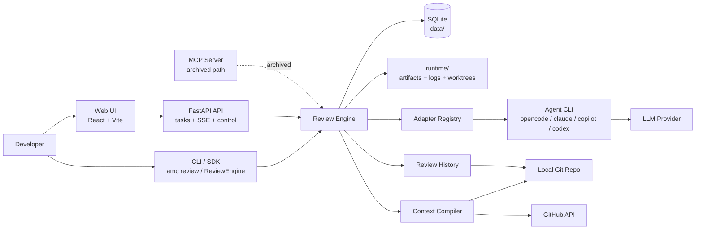
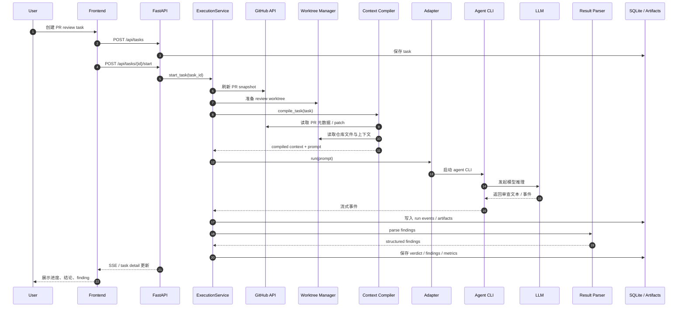
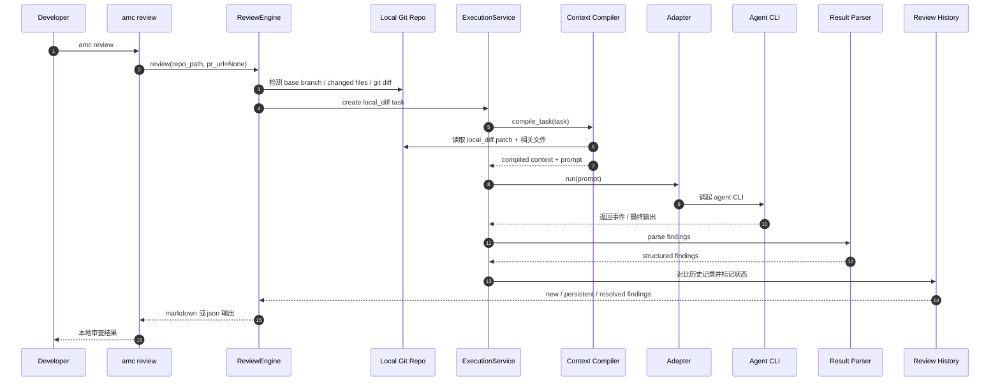
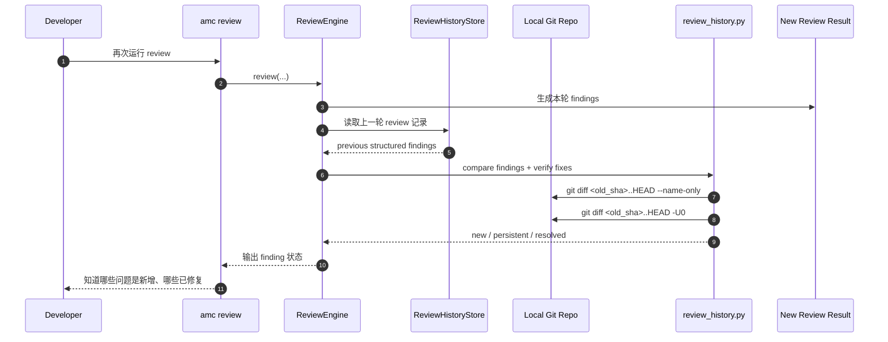
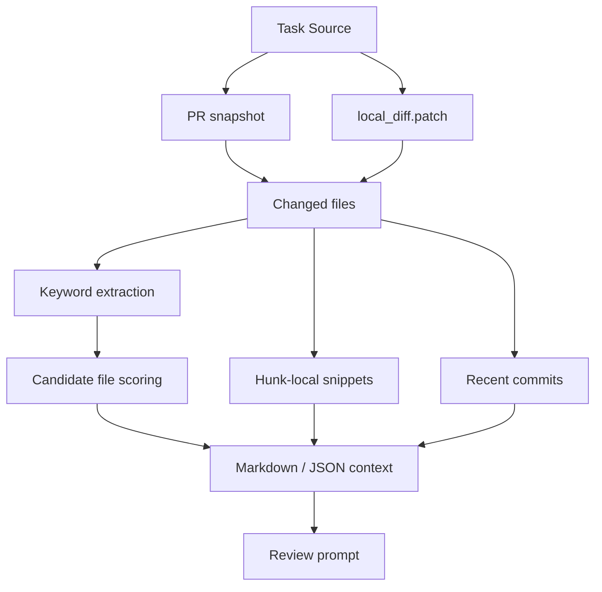

# Mission Control 架构图与关键时序图

本文档给出 `mission-control` 当前主设计的正式图示版本，重点展示：

1. 系统静态架构；
2. PR review 的主时序；
3. local diff review 的主时序；
4. 增量 review / fix verification 的关键链路；
5. 各组件职责边界。

如果想看更完整的设计背景和迭代历史，请结合 [`project-design-history.md`](project-design-history.md) 一起阅读。

## 1. 系统静态架构

### 设计要点

- **Web UI、CLI、SDK 共用同一个 review engine**，避免分叉实现。
- **GitHub PR** 与 **local diff** 共用同一条审查主链路，只在上下文来源上分支。
- **Adapter Registry** 把框架和具体 agent CLI 解耦。
- **SQLite + runtime artifacts** 负责状态与审查证据落地。
- **MCP** 保留代码，但不再是当前主路径。

## 2. 模块职责分层

| 层 | 主要位置 | 职责 |
|---|---|---|
| Interface Layer | `frontend/`, `backend/app/cli.py`, `backend/app/sdk.py` | 提供 Web UI、CLI、SDK 入口 |
| API Layer | `backend/app/api/` | REST / SSE / 控制接口 |
| Orchestration Layer | `backend/app/core/execution.py`, `sdk.py` | 创建 task、启动 review、采集事件、结束收尾 |
| Context Layer | `backend/app/core/context_compiler.py` | 汇总 patch、文件候选、recent commits、snippets、prompt |
| Integration Layer | `backend/app/adapters/` | 调起不同 agent CLI |
| Result Layer | `backend/app/services/review_result_service.py`, `review_history.py` | findings 解析、history 对比、fix verification |
| Persistence Layer | `data/`, `runtime/` | SQLite、artifact、日志、worktree、快照 |

## 3. PR Review 主时序

下面是 Web UI 发起 GitHub PR review 时的主流程。

### 这个流程里的关键边界

- PR review 需要 **GitHub API** 来补充 PR snapshot。
- 上下文编译与模型执行是两段式：先 `compile`，再 `run`。
- SSE 只是显示运行态，真正的权威状态仍落在 SQLite / artifacts。

## 4. Local Diff Review 主时序

下面是 `amc review` 在未提供 PR URL 时的本地审查主流程。

### 这个流程的设计意义

- 不依赖 GitHub PR URL，适合个人日常开发中高频使用。
- 和 PR review 共用大部分核心能力，只是输入来源改成 `git diff`。
- 更容易和“开发一批 → review 一次 → 修一批”节奏结合。

## 5. 增量 Review / Fix Verification 时序

增量 review 是项目后续非常重要的一条设计线。当前关键链路如下：

### 当前实现特点

- fix verification 已从“每个 finding 单独跑 subprocess”改成“**批量解析 diff state 复用**”；
- 这显著降低了增量验证成本；
- 第二层 AI re-verification 仍是可选未来方向，不是当前主路径。

## 6. Context Compilation 细化结构

上下文编译是最近一轮优化的核心，当前可以理解成：

### 当前优化方向的真实结论

- **Adaptive budget**：可以压低低信号上下文；
- **Hunk-local snippets**：能把上下文从“文件名提示”提升到“局部代码片段”；
- **Batch verification**：收益已经被 benchmark 明确证明；
- **A/B benchmark**：说明不是每种上下文膨胀都自动带来更好效果。

## 7. 组件边界：什么由框架负责，什么不由框架负责

### 框架负责

- task / run 编排
- 上下文收集与 prompt 构建
- 调起 agent CLI
- 运行事件采集
- findings 解析
- 增量历史对比
- artifact / metrics 落地

### 框架不负责

- 替代底层模型的推理能力
- 自动修改业务代码
- 自动运行所有 build/test/部署动作
- 充当线上协作平台或团队 SaaS

这也是为什么当前项目适合被理解为 **个人 review 工作台**，而不是“全能自动软件工厂”。

## 8. 当前推荐阅读顺序

如果你想快速重新建立上下文，建议按这个顺序看：

1. [`../README.md`](../README.md)
2. [`project-design-history.md`](project-design-history.md)
3. 本文档
4. `backend/app/core/context_compiler.py`
5. `backend/app/core/execution.py`
6. `backend/app/sdk.py`
7. `backend/app/services/review_history.py`

## 9. 文档结论

这份图示文档要表达的核心只有一句：

> `mission-control` 的主设计已经不是“若干零散功能”，而是一套围绕 **review orchestration** 收敛起来的本地优先系统；不同入口、不同 review source、不同 agent backend，最终都汇入同一条可追踪的核心链路。
