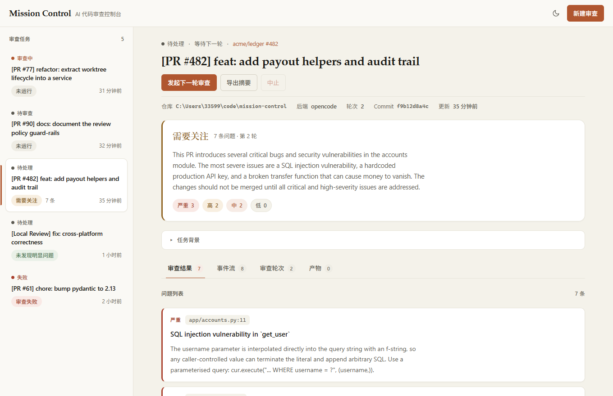
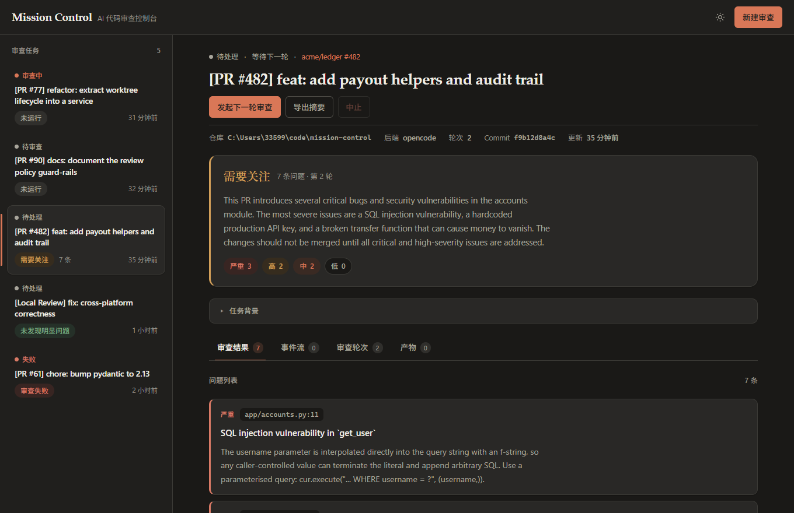
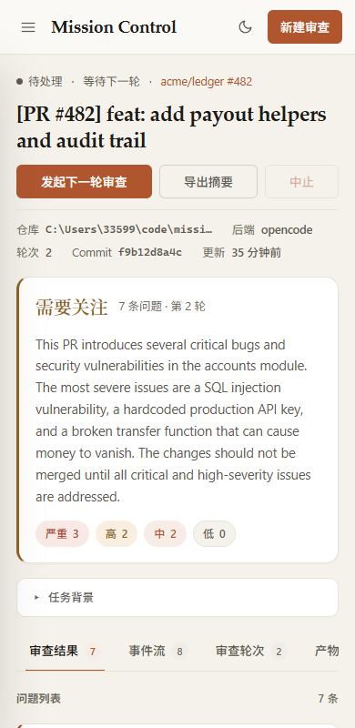

# Frontend

React + TypeScript + Vite single-page console for PR review management.

Dark theme &amp; mobile

## Features
- Task list sidebar with status indicators; collapses to a drawer under 900px
- Verdict banner summarising the latest round: verdict, finding count, severity breakdown
- Findings list with severity rail, monospace `file:line`, and per-finding detail
- Review timeline with real-time SSE event streaming
- Review round history with per-round verdict, note, duration, and commit
- Artifacts tab for context snapshots, diffs, and summaries
- Modal-based task creation from GitHub PR URLs
- Light and dark themes; follows the OS preference, remembers an explicit choice

## Design system

Tokens live at the top of `src/styles.css`. Everything else consumes CSS custom
properties, so re-theming means editing one block.

| Group | Tokens |
|---|---|
| Surfaces | `--bg`, `--surface`, `--surface-sunken`, `--surface-hover` |
| Lines | `--border`, `--border-strong` |
| Text | `--text`, `--text-secondary`, `--text-muted` |
| Brand | `--accent`, `--accent-hover`, `--accent-soft`, `--accent-ring` |
| Semantic | `--ok`, `--warn`, `--danger`, `--neutral` (+ `-soft` fills) |
| Type | `--font-sans`, `--font-serif`, `--font-mono` |

Conventions worth keeping:

- **Warm neutrals, not grey.** Surfaces carry a slight yellow cast; dark mode is
  a warm near-black rather than pure black.
- **Colour means something.** Hue is reserved for status, verdict, and severity.
  Chrome is neutral.
- **Serif for voice, sans for UI.** The brand, page title, verdict word, and
  round number use `--font-serif`; controls and data use `--font-sans`.
- **Monospace for identifiers.** Paths, SHAs, and event kinds use `--font-mono`
  so they are scannable and never re-wrap mid-token.
- **Fonts are system stacks.** No webfont requests — this is a local-first tool
  and should render instantly offline.
- **Prose stays readable.** Long text is capped around 72–74 characters.
- Dark mode is driven by `data-theme` on `<html>`; `prefers-color-scheme` only
  seeds the initial value.
- `prefers-reduced-motion` disables the running-task pulse and transitions.

## Run
- From the repository root: `./scripts/dev-frontend.sh`
- Default: `http://127.0.0.1:5173` (proxies API to backend on `:8000`)

## Build
- From this directory: `npm run build`
- Type check only: `npx tsc --noEmit`
